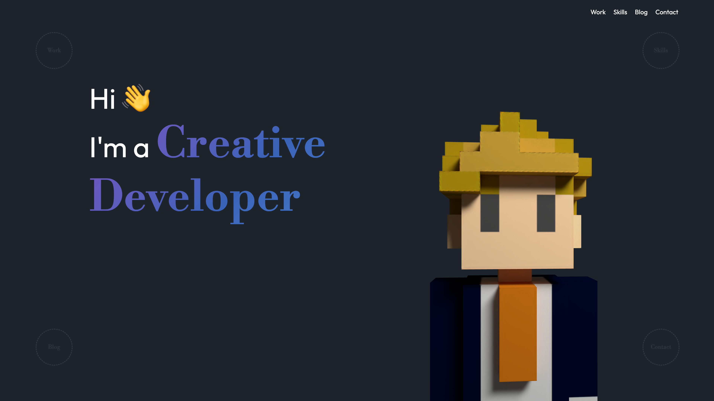
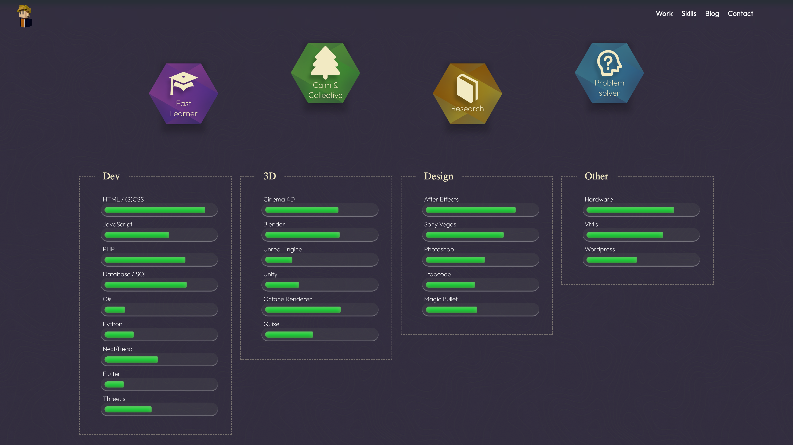
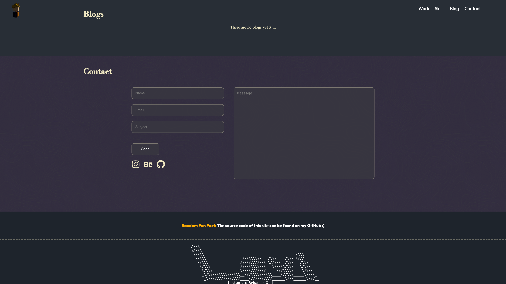
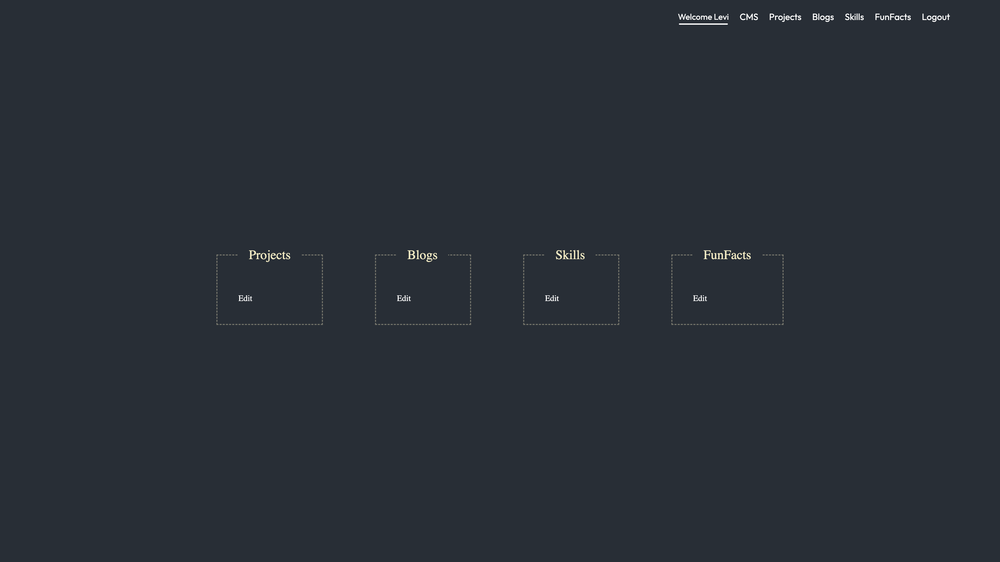
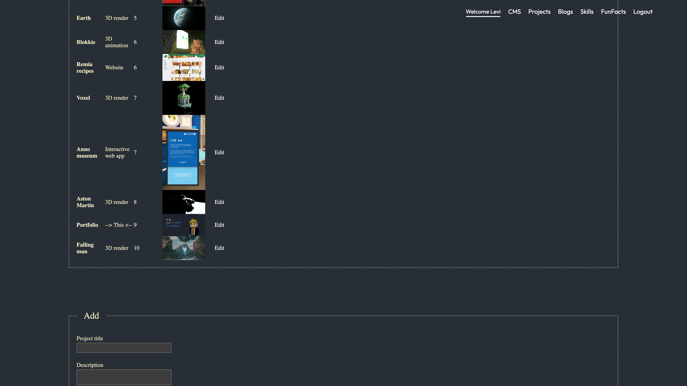
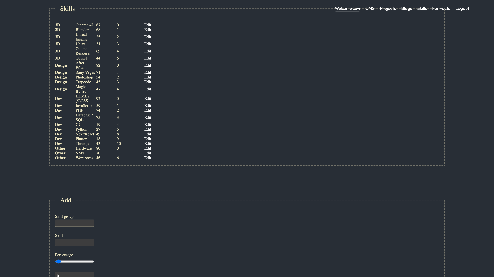
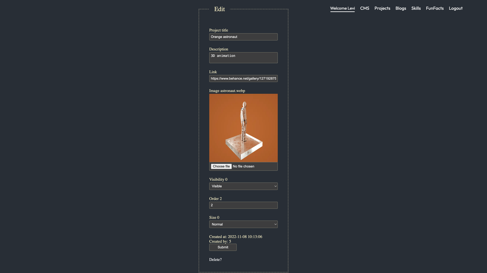

# Preview images

# personal-portfolio
~~Live version can be found at: https://levi.cool/~~ **Outdated**

# Structure
Styling, components, js and images can be found in the /includes folder
SCSS and CSS are separated. Most of the SCSS can be found inside the _main-style.scss file.
